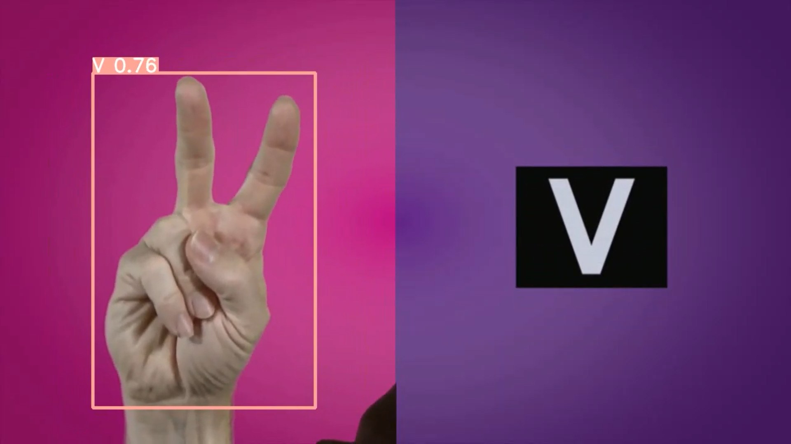
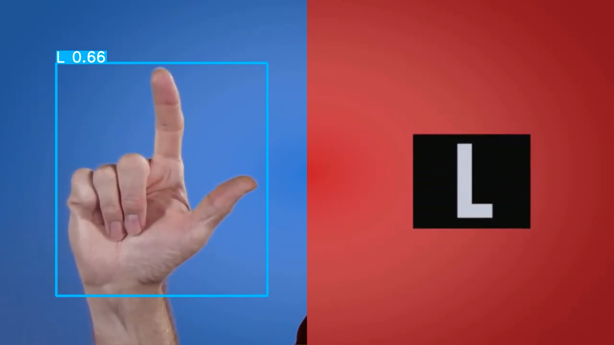
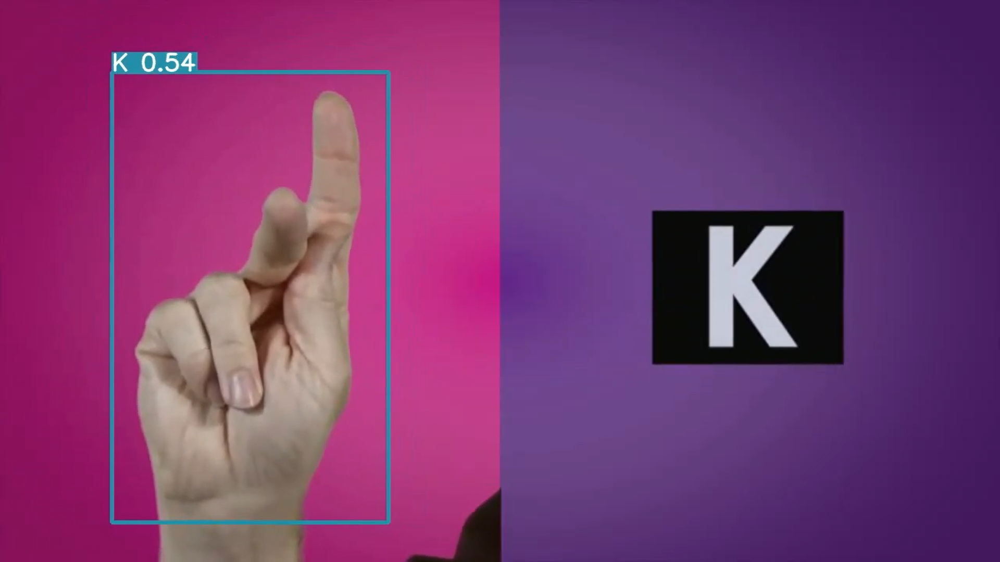

<H1 align="center">
Sign Language Alphabets Detection and Recongition using YOLOv8 </H1>

## Google Colab File Link (A Single Click Solution)
The google colab file link  is provided below, you can check the implementation in Google Colab, and its a single click implementation
,you just need to select the Run Time as GPU, and click on Run All.

[`Google Colab File`](https://colab.research.google.com/drive/1ITdJrATdpu3zE99HYPXZ42exQWLrWRp0?usp=sharing)

## YouTube Video Tutorial Link

[`YouTube Link`](https://www.youtube.com/watch?v=-UoSr9Z_Bg0)

### RESULTS

#### Sign Language Alphabets Detection and Recognition  

#### Sign Language Alphabets Detection and Recognition  

#### Sign Language Alphabets Detection and Recognition  

### Watch the Complete Step by Step Explanation

- Video Tutorial Link  [`YouTube Link`](https://www.youtube.com/watch?v=-UoSr9Z_Bg0)

)
